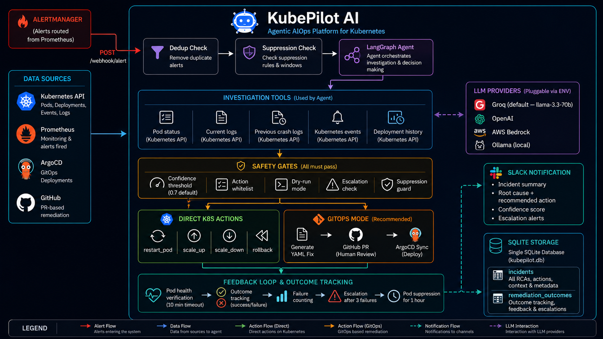
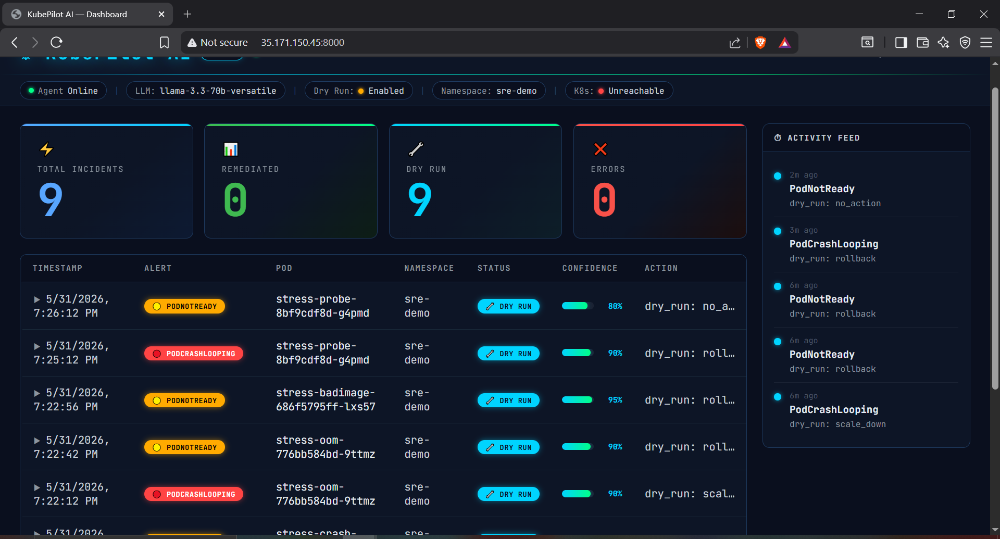
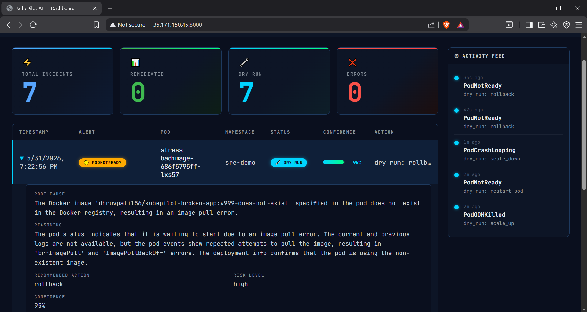

# KubePilot AI

Agentic AIOps platform that autonomously investigates and remediates Kubernetes incidents — so engineers review decisions, not alerts.

[](https://python.org)
[](https://fastapi.tiangolo.com)
[](https://langchain-ai.github.io/langgraph/)

---

## The Problem

On-call engineers spend most of an incident reading the same logs, running the same kubectl commands, making the same restart decisions. KubePilot AI automates that procedure so engineers focus on what actually requires judgment.

---

## What It Does

When Prometheus fires an alert, KubePilot AI:

1. Receives the webhook from Alertmanager
2. Runs a LangGraph agent — reads pod status, logs, previous crash logs, events, deployment history
3. Produces a structured RCA with confidence score and reasoning trace
4. Remediates through safety gates (confidence threshold, action whitelist, dry-run mode)
5. Verifies the fix worked — escalates to Slack if the same pod keeps failing

---

## Architecture



<p align="center">
  
  
</p>

---

## Stack

| Layer         | Technology                                              |
| ------------- | ------------------------------------------------------- |
| Agent         | LangGraph                                               |
| LLM           | Groq llama-3.3-70b (pluggable: OpenAI, Bedrock, Ollama) |
| API           | FastAPI                                                 |
| Kubernetes    | Python kubernetes SDK                                   |
| GitOps        | GitHub API + ArgoCD                                     |
| Observability | Prometheus + Alertmanager + Grafana                     |
| Storage       | SQLite                                                  |
| Notifications | Slack Block Kit                                         |

---

## Running on Kubernetes

### Prerequisites

```bash
# Docker — https://docs.docker.com/get-docker/

# Kind
curl -Lo ./kind https://kind.sigs.k8s.io/dl/v0.20.0/kind-linux-amd64
chmod +x ./kind && sudo mv ./kind /usr/local/bin/kind

# kubectl
curl -LO https://dl.k8s.io/release/v1.27.3/bin/linux/amd64/kubectl
chmod +x kubectl && sudo mv kubectl /usr/local/bin/kubectl

# Helm
curl https://raw.githubusercontent.com/helm/helm/main/scripts/get-helm-3 | bash
```

### Step 1 — Get a Groq API key

Free at [console.groq.com](https://console.groq.com). Also supports OpenAI, AWS Bedrock, and Ollama — see `.env.example`.

### Step 2 — Export your key

```bash
export GROQ_API_KEY=gsk_your_key_here
```

The setup script reads this variable and stores it in a Kubernetes Secret. The key never touches disk and is never committed to git.

### Step 3 — Run setup

```bash
git clone https://github.com/Dhruvpatil56/KubePilot-AI
cd KubePilot-AI
chmod +x setup.sh
./setup.sh
```

This will:

- Spin up a 3-node Kind cluster
- Create namespaces and RBAC
- Store your key in `kubepilot-secrets` K8s Secret
- Deploy Prometheus + Alertmanager + Grafana via Helm
- Wire Alertmanager to forward pod alerts to the healing agent
- Deploy the healing agent and broken-app from DockerHub

### Step 4 — Open the dashboard

```bash
kubectl port-forward -n sre-demo deployment/healing-agent 8000:8000 --address 0.0.0.0
```

Open `http://localhost:8000`

### Step 5 — Run a stress test

```bash
./run_stress_test.sh
```

Creates 4 real failure scenarios (CrashLoopBackOff, OOMKilled, ImagePullBackOff, liveness probe failure). Watch the agent diagnose each one on the dashboard.

### Stopping

```bash
./teardown.sh                          # scale to zero, cluster stays alive
kind delete cluster --name kubepilot   # destroy everything
```

---

## API

| Endpoint              | Description               |
| --------------------- | ------------------------- |
| `GET /`               | Dashboard                 |
| `GET /health`         | DB + K8s connectivity     |
| `GET /incidents`      | Incident history          |
| `POST /webhook/alert` | Alertmanager webhook      |
| `GET /feedback/{pod}` | Pod remediation history   |
| `GET /gitops/status`  | GitOps config             |
| `GET /api/info`       | Service info + LLM config |

---

## Images

```
dhruvpatil56/kubepilot-healing-agent:v4
dhruvpatil56/kubepilot-broken-app:v3
```


